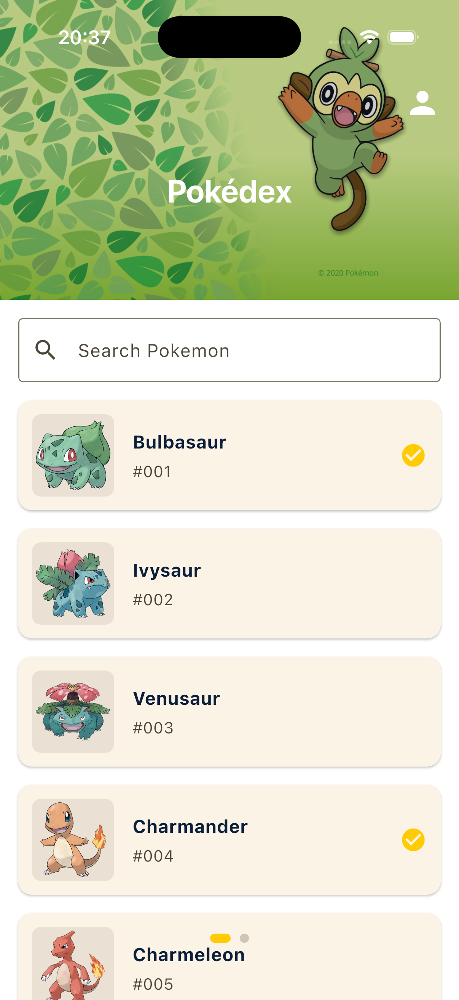
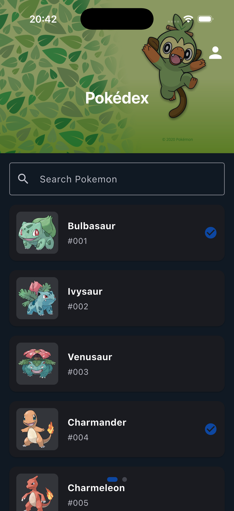
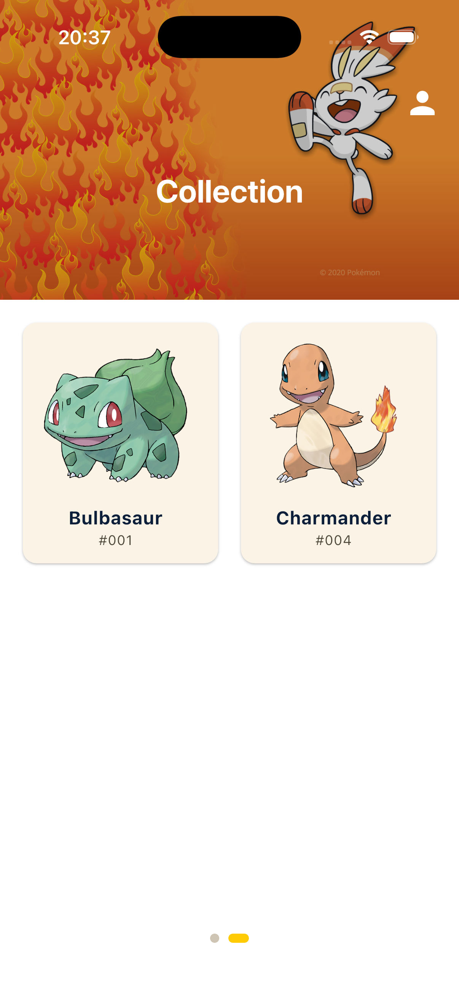
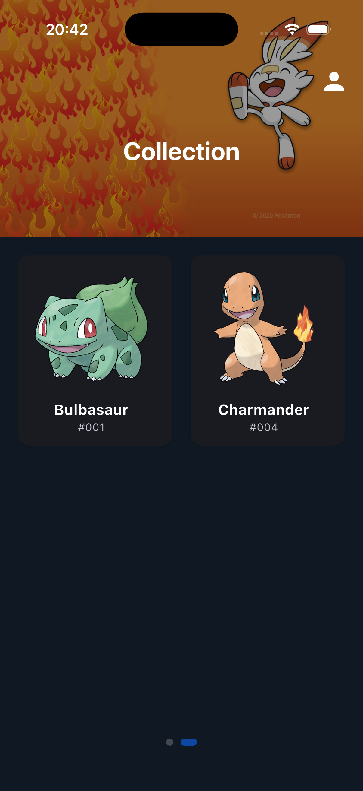
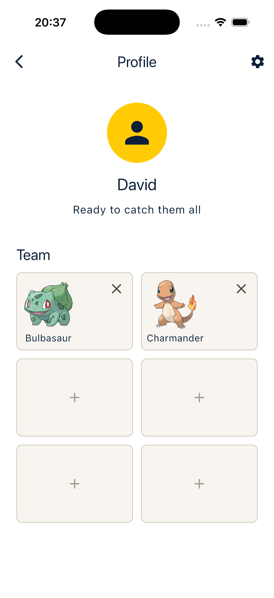
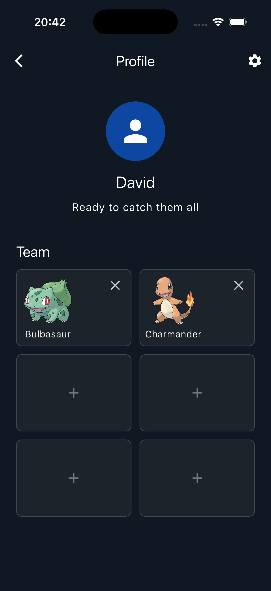
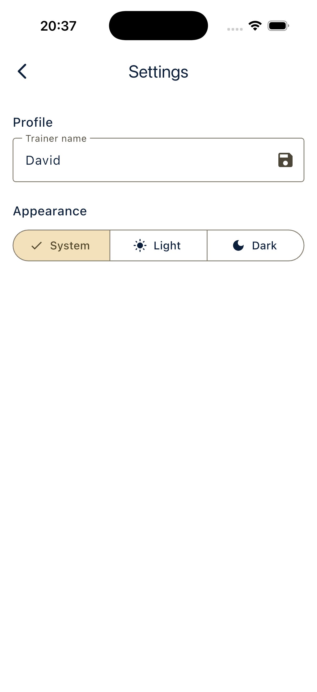
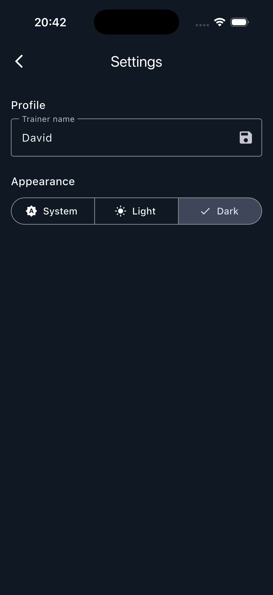

# Fluttermon

Fluttermon is a small mobile Pokédex app built with Flutter. The app lets users browse Pokémon, search through the Pokédex, open a detail page, save Pokémon to a personal collection, and build a six-slot team from collected Pokémon.

The project uses the Pokémon domain because it gives a clear mobile app use case: list browsing, detail pages, image loading, local persistence, searching, and user-managed state.

## Features

- Pokédex with scrollable Pokémon cards.
- Local Pokémon index loaded from `assets/data/pokemon_db.json`.
- Search with validation outside the widget layer.
- Pokémon detail page using the PokeAPI for live detail data.
- Collection page for saved Pokémon.
- Profile page with a six-slot team built from collected Pokémon.
- Settings page with light/dark/system theme switching.
- Trainer name stored locally with SharedPreferences.
- Loading, error, and empty states for asynchronous operations.

## Screenshots

| Light mode | Dark mode |
| --- | --- |
|  |  |
|  |  |
|  |  |
|  |  |

## Setup

This project expects a recent Flutter SDK with Dart 3.11 support. The project was developed with the SDK constraint in `pubspec.yaml`:

```yaml
environment:
  sdk: ^3.11.5
```

Check your local Flutter installation:

```sh
flutter --version
flutter doctor
```

Install dependencies:

```sh
flutter pub get
```

Run the app on an emulator or connected device:

```sh
flutter run
```

Run tests:

```sh
flutter test
```

Run static analysis:

```sh
flutter analyze
```

## Main Packages

- `provider`: State management for the Pokédex, collection, team, profile, settings, and navigation state.
- `http`: Fetching Pokémon detail data from the PokeAPI.
- `shared_preferences`: Local persistence for settings, trainer profile, collection, and team.
- `flutter_launcher_icons`: Generates launcher icons from the configured app icon.
- `flutter_test`: Unit and widget testing.
- `flutter_lints`: Static analysis rules for cleaner Dart and Flutter code.

## Data Sources

The app uses a mix of local and remote data:

- `assets/data/pokemon_db.json`: Local Pokémon index generated from the PokeAPI list endpoint. This keeps search fast and avoids loading the full list from the network every time.
- [PokeAPI Pokémon endpoint](https://pokeapi.co/docs/v2#pokemon): Used when opening a Pokémon detail page for types, stats, artwork, and species URL.
- [PokeAPI Pokémon Species endpoint](https://pokeapi.co/docs/v2#pokemon-species): Used for the Pokédex description and genus text.
- `assets/images/types/`: Local type badge sprites downloaded from PokeAPI sprite resources.

## Architecture

The project follows a layered structure:

```text
lib/
  models/      Data classes and JSON parsing
  services/    API calls, asset loading, and SharedPreferences access
  providers/   ChangeNotifier state and app logic
  screens/     Full app screens
  widgets/     Reusable UI components
  validators/  Input validation functions outside widgets
```

This keeps API/storage code out of widgets and keeps UI screens focused on rendering state.

## Testing

The `test/` folder contains:

- Model tests for JSON parsing and serialization.
- Validator tests for search and trainer name input.
- Service tests for SharedPreferences persistence.
- Provider tests for state changes.
- A widget test for the settings screen.
- A comprehensive widget flow test in `test/widgets/user_flow_test.dart` that changes the trainer name, adds a Pokémon to the collection from the detail page, and adds that Pokémon to the profile team.

All tests should pass with:

```sh
flutter test
```
